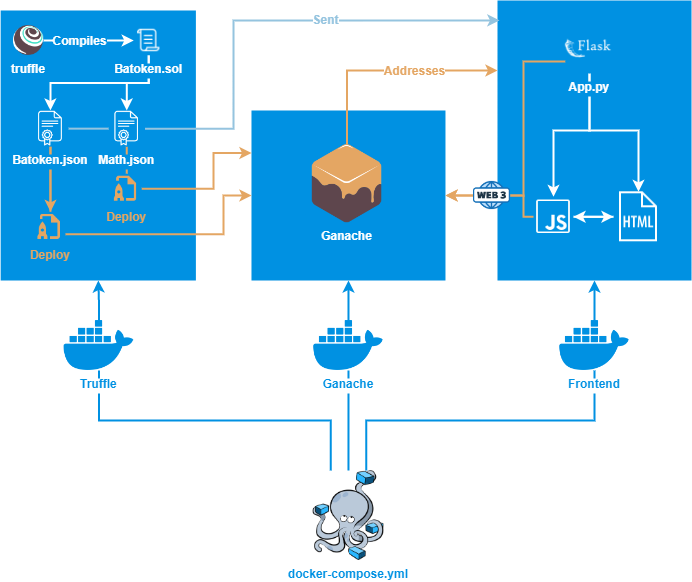

# BATMAN
Blockchain Advanced Threats and Malwares Aggregation Network

## Introduction

### Motivation

Nowadays, social platforms create virtual sharing environments based on different
themes that unite groups of users having common interests with each other. Similarly,
BATMAN aims to propose a distributed platform for sharing Proof of Concept of
malware that can be read,verified and appreciated through a donation from users. The
idea for this project draws from the existing exploit-DB, which is a CVE compliant
archive of public exploits of vulnerabilities, but different from this, BATMAN is a
distributed archive based on a blokchain technology.

### The aim of the DApp

Users who decide to be part of BATMAN all have the same rights to be able to read
and publish, unique proof of concepts (PoC) of a malware. A PoC is unique in the
sense that it cannot be republished by any other user thanks to an hash check of
the PoC’s content. BATMAN allows everyone in the blockchain to vote for PoCs to
make them verified, and in order to do that who wants to vote must have a minumum
number of tokens that can increase every time a PoC is verified. A PoC in order to
obtain the verification flag must be voted by a majority of users who are members of
BATMAN, i.e. half of all users plus one and in order to vote, as said before, every
user must spend a certain amount of BAToken. When the majority is reached, the
PoC’s owner will earn 20 % of the total amount of BATokens spent by voters. Each
voter on the other hand will earn a percentage equal to: the ratio of the number of
BATokens spent by the voter and the total BATokens spent by everyone. Since new
tokens are created out of nothing, in order to balance the voting cost and the gain
of both the voters and the PoC’s author, every time a PoC is verified the verify cost
increases proportionally to the number of tokens added to the total balance of the
smart contract after the verification of the PoC.
BATMAN offer to the users the possibility to donate a certain amount of tockens
to PoC’s publishers expressing his or her liking by sending an arbitrary number of
BATokens to the PoC publisher. However, if no donation takes place, the only way a
publisher of a PoC can make a profit is through the verification of his PoC. Users can
lose their BATokens used for verify a certain PoC, if a majority of votes for that PoC
is never reached.

### Why use a blockchain

BATMAN is inspired by exploit-db that is a centralized archive
of public exploits where only a restricted group of people can verify the truthfulness of them.
The same idea in a blockchain allows to make the verify process opened to everyone
using a majority system and a fungible token that regulates the verify mechanism to
encourage people to be correct in the vote. This allows to verify quickly and in a
reliable way the proof of concepts being published.
Another reason for which a blockchain is a valid choice for this service is that every
published PoC and exploit will remain available and consultable no matter what, said
in a more technical manner the system becomes more reliable, and the reliability is
given by design of the blockchain itself.
In the end the token that regulates the verify process for the PoCs can be easily written
using the Solidity language and can be executed in the Ethereum Virtual Machine.

## Software architecture

To simplify the DApp startup in a development environment, docker was used as the
orchestrator that manages the DApp components, specifically, as described in figure
5, at startup three containers are created: Truffle, Ganache and Frontend. The first
one is an auxiliary container that helps us to: compile the smart contract, deploy it
to the ganache service and share the compiled smart contracts’ ABIs to the frontend
container. The Ganache container runs the Ganache service exposing the default port
8545 to the other containers. It generates random private keys and the relative public
addresses and it sends them to the frontend container, allowing it to create random
credentials for each address. At the end the frontend container takes the ABIs and the
smart contract’s address sent by Truffle container, the accounts addresses sent by the
Ganache container and creates a development environment with already registered
users and all the necessary components to interconnect the blockchain to the user
interface.



### Frontend container

The frontend is served using the Flask framework that is a web micro-framework
written in Python, based on the Werkzeug WSGI tool and the Jinja2 template engine.
The frontend container is started right after truffle finished to deploy contracts on
Ganache. After the startup the app’s settings are generated inside settings.py that
comprehend: the smart contract’s ABI and address, the blockchain’s addresses and
private keys, the credentials associated to the addresses. After all the settings are
set, app.py is ready to serve the frontend files and to call the smart contract methods
through the BAToken class defined inside batoken.py.

## Smart Contract

In BAToken.sol we find the implementation of the smart contract that encapsulates
the logic of our blockchain.
As described above, the voting object is a PoC published by a user that can be in
turn a voter of another PoC published by someone else.
All PoCs in the blockchain are saved in a list and a PoC contains the following
attributes:

- pocID(uint): identifies a poc
- author(address): address of the person who publishes the Poc
- language(string): language type of the code of the PoC (Python, C..)
- pocHash(bytes32): hash of the PoC to guarantee its authenticity
- severity(uint): the severity level of the PoC
- cve(string): identifier of the vulnerability exploited by the PoC
- exploitType(string): the exploit type of a vulnerability which can be of 4 types,
    namely remote, local, DOS, webapp


- title(string): the title of the PoC
- verified(bool): if this parameter is set to true, it means that the PoC has been
    verified by the majority of users
- verifiers(address[]): in this array we store the addresses of the users who voted
    for the specific PoC
- tokens(uint[]) : array that maps the amount of tokens spent by each user that
    voted for the specific PoC

In addition, other smart contract’s attributes are:
- the price of a single BAToken equal to 2 finney (PRICE: uint public constant)
- the number of total addresses in the network(totalAddresses: uint)
- the amount of total tokens within the blockchain(totalBalance: uint)
- the balance for each user within the blockchain (balance: mapping(address =¿
    uint))
- the tokens to spend in order to verify, initialized to 10 (verifyCost: uint)

The smart contract’s methods are:

- Verify(uint pocID): takes as input the PoC’s ID. It first verifies that: the PoC
    exists, that it hasn’t already been verified by msg.sender, that the msg.sender
    isn’t the PoC’s publisher, and that msg.sender has enough tokens to verify the
    PoC. If the checks pass then the msg.sender is added to the PoC’s verifiers list.
    Finally, if the majority is reached, the rewards of the author of the PoC and of
    the verifiers are provided, in particular the PoC’s author gains 20% of tokens
    spent by the verifiers, and the verifiers gain the percentage of the tokens spent.
- updateVerifyCost(uint initialBalance): As the total BATokens in the blockchain
    increase from the various rewards, there is an increase also in the verify cost.
    This function calculates the increase in verify cost using the following formula:
    verif yCost=verif yCost+verif yCost∗(initialBalancetotalBalance −1).
- hasVerified(uint pocID, address verifier): this function returns true if the PoC
    with the specific pocID provided in input, has already been verified by the
    verifier.
- checkPoCExistence(bytes32 pocHash): verifies the existence of a PoC.


- Publish(string memory poc, uint severity, string memory cve, string memory
    type, string memory title, string memory language):with this function a PoC
is published, through the addition of a new PoC object whose attributes are filled
based on user input or left empty if they are intended to change over time. The
PoC will be published only if it has not been previously published by anyone
else.
- ReadAll(PoC[] memory):returns us all published PoCs
- Donate(address recipient, uint amount):allows a user to donate an arbitrary
    number of BATokens unless the PoC is published by him and he has fewer
    BATokens than the amount he wants to donate.

## Known Issues and Limitation

Users can vote randomly with a possibility of break the validation system, obviously
this is unincentivated with the rewards mechanism.
Usually PoC’s body are small (few KB), but large exploits requires a big amount of gas
to be published and in that case the system we proposed may not be valid anymore.
The mechanism behind the validation is an inflationary process, in the sense that the
more users vote, the more the cost of voting increases, and therefore decreasing the
”purchase power” that in this case is the vote power of the users. To overcome this
problem in future works can be designed a deflationary process similar to the one
presented in the London upgrade for the Etherum blockchain.

## Structure of the project

```bash
.
├── README.md
├── contract
│   ├── Dockerfile
│   ├── contracts
│   │   └── BAToken.sol # smart contract code
│   ├── migrations
│   │   └── 0_migration.js # used for deploy
│   ├── test
│   └── truffle-config.js
├── database
│   └── README.md
├── docker-compose.yml
├── frontend
│   ├── Dockerfile
│   ├── app
│   │   ├── app.py
│   │   ├── batoken.py
│   │   ├── settings.py
│   │   ├── static
│   │   │   ├── css
│   │   │   │   └── style.css
│   │   │   ├── js
│   │   │   │   ├── index.js
│   │   │   │   ├── nav.js
│   │   │   │   └── publish.js
│   │   │   └── semantic
│   │   │       └── ...      
│   │   └── templates
│   │       ├── head.html
│   │       ├── index.html
│   │       ├── login.html
│   │       ├── nav.html
│   │       └── publish.html
│   ├── requirements.txt
│   └── wait-for-deploy.py
├── images
│   └── components_diagram.png
└── shared
    ├── README.md
    ├── ganache
    │   └── README.md
    └── truffle
        └── README.md
```

## Run the project
### Prerequisites
You must have docker to run the project, follow the official guide to download it [Get Docker](https://docs.docker.com/get-docker/).
### Run
Open a terminal and type ```docker compose up``` in the root of the project.

Wait for the frontend service to start and then in order to play with the project go to http://127.0.0.1:5000 and log in with one of the users inside database/db.json.